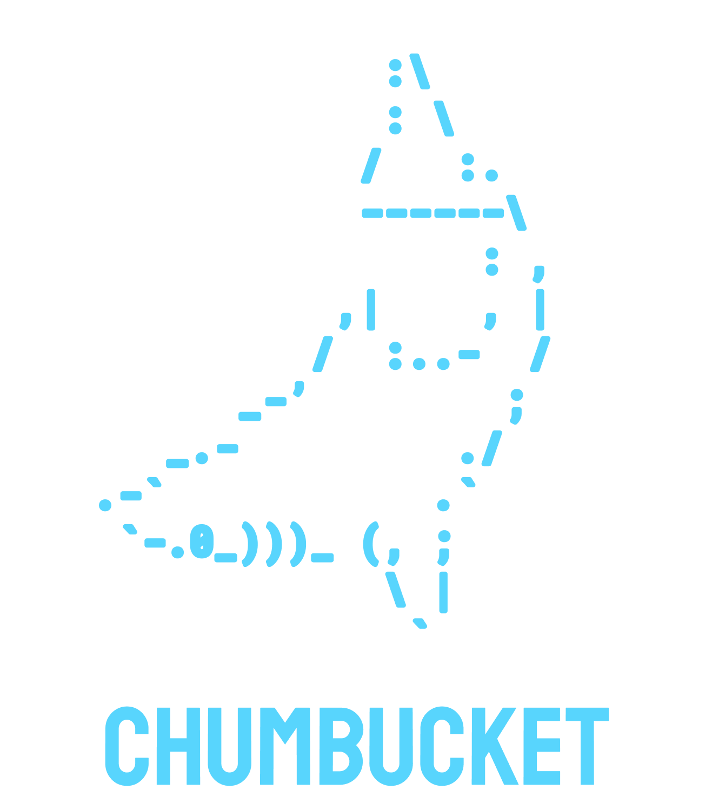

a kit to build quick demo apps and test ideas (chumming the water so to speak )

---

# Why make this?

- a kit to build quick demo apps and test ideas (chumming the water so to speak )
- Its got one global state focusing on (data = view)
- routing is super transparent
- who needs folders in such small apps
- simple entry point if you want to change the UI
- Good for glitch projects

# Whats inside

- 🖼️ UI = [nanohtml](https://github.com/choojs/nanohtml)
- 🍖 Store = [Obake.js](https://github.com/stagfoo/obake)
- 🦴 Router = [Page.js](https://visionmedia.github.io/page.js/)
- 🍹 Styles = Just Javascript and strings [Joro](https://github.com/stagfoo/joro).

# whats a chumbucket

a bucket for holding a form of bait used to attract sharks

